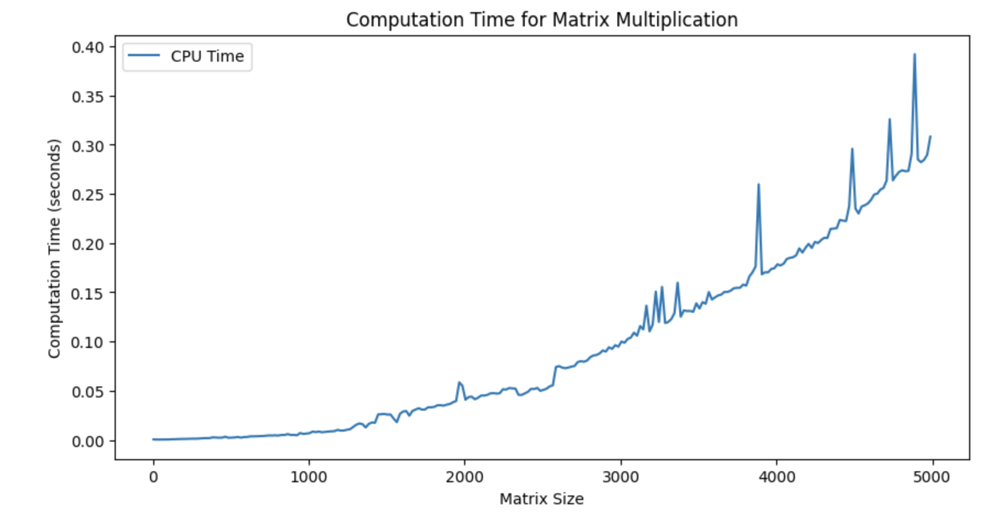
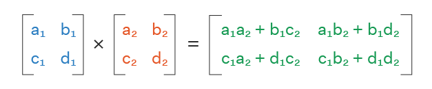

# Introduction





## Matrix memory footprint
Let assume the matrix size is 20000 elements, then 
20000 × 20000 × 4 = 16000000 bytes = 1.49 GiB
is needed to store one matrix.

For all matrices, 1.49 X 3 = 4.47 GiB is needed.

The Nvidia 2080 Ti GPU has exactly 11 GiB. 

```python
import tensorflow as tf
import time
```

```python
size = 10000
A = tf.random.normal([size, size])
B = tf.random.normal([size, size])
```

```python
with tf.device('/CPU:0'):
    start_time = time.time()
    C_cpu = tf.matmul(A, B)
    C_cpu.numpy()
    cpu_time = time.time() - start_time
print(f"CPU time: {cpu_time}")
```
CPU time: 1.8533074855804443

## GPU 
```python
if tf.config.list_physical_devices('GPU'):
    with tf.device('/GPU:0'):
        start_time = time.time()
        C_gpu = tf.matmul(A, B)
        C_gpu.numpy()
        gpu_time = time.time() - start_time
    print(f"GPU time: {gpu_time}")
else:
    print("No GPU found. Please ensure TensorFlow is setup with GPU support.")
```
GPU time: 0.3933844566345215
